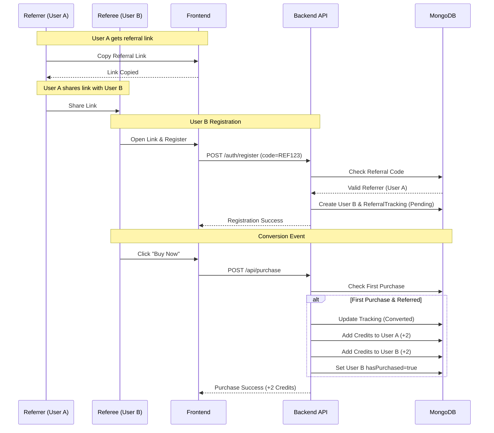

# System Design: Referral & Credit System

## 1. Overview
A full-stack web application that allows users to register, refer friends via unique links, and earn credits when those friends make a purchase.

## 2. Architecture
The application follows a standard **Client-Server** architecture.

### Client (Frontend)
- **Framework**: Next.js 14 (App Router)
- **Styling**: Tailwind CSS
- **State Management**: Zustand (for Authentication state)
- **HTTP Client**: Axios
- **Key Pages**:
    - Landing Page (`/`): Marketing & CTA.
    - Login/Register (`/login`, `/register`): Auth forms.
    - Dashboard (`/dashboard`): User stats, referral link display.
    - Purchase of Marketplace (`/purchase`): Purchase simulation.

### Server (Backend)
- **Runtime**: Node.js
- **Framework**: Express.js
- **Language**: TypeScript
- **Database**: MongoDB (with Mongoose ODM)
- **Authentication**: JWT (JSON Web Tokens)

## 3. Database Schema

### User Collection
Stores user account information and balances.
- `username`: String, Required
- `email`: String, Unique, Required
- `password`: String, Hashed
- `referralCode`: String, Unique (Generated on registration)
- `referredBy`: ObjectId (Ref: User, Optional) - Who referred this user
- `credits`: Number (Default: 0)
- `hasPurchased`: Boolean (Default: false) - Track first purchase for rewards

### ReferralTracking Collection
Tracks the status of specific referral relationships.
- `referrerId`: ObjectId (Ref: User)
- `refereeId`: ObjectId (Ref: User)
- `status`: Enum ['pending', 'converted']
- `createdAt`: Date

## 4. API Endpoints

### Authentication
- `POST /api/auth/register`: Create new user (handles referral code lookup).
- `POST /api/auth/login`: Authenticate and return JWT.
- `GET /api/auth/me`: Validate token and return current user context.

### Referrals
- `GET /api/referrals/stats`: Returns:
    - `totalReferrals`: Count of users referred.
    - `convertedReferrals`: Count of referrals who purchased.
    - `totalCredits`: Current balance.
    - `referrals`: List of referred users.

### Purchase
- `POST /api/purchase`: Simulates a transaction.
    - **Logic**:
        1. Checks if it's the user's first purchase.
        2. If YES and user was referred:
            - Updates `ReferralTracking` status to `converted`.
            - Awards 2 credits to the **Referrer**.
            - Awards 2 credits to the **Referee** (Buyer).
        3. Marks user `hasPurchased = true`.

## 5. Security & Validation
- **Passwords**: Hashed using `bcryptjs`.
- **Tokens**: JWT for stateless authentication, sent in `Authorization` header.
- **CORS**: Enabled for frontend-backend communication.
- **Validation**: Mongoose schema validation.

## 6. Workflow
1. **Sign Up**: User A signs up. Generates code `REF123`.
2. **Share**: User A shares `website.com/register?r=REF123`.
3. **referral**: User B clicks link. auto-fills code `REF123`.
4. **Registration**: User B created. `referredBy` set to User A._id.
5. **Tracking**: `ReferralTracking` doc created (Status: Pending).
6. **Conversion**: User B buys an item.
    - Backend detects first purchase.
    - User A gets +2 Credits.
    - User B gets +2 Credits.
    - Status updates to `converted`.

## 7. UML Sequence Diagram (Referral Flow)

